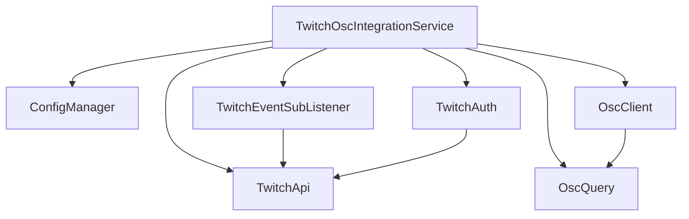
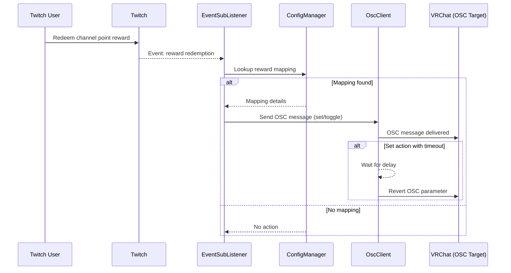

# Twitch Channel Points to OSC Bridge

## 1. Introduction

This project bridges Twitch channel point reward redemptions with OSC (Open Sound Control) messages, enabling real-time control of VRChat avatar parameters (or other OSC-compatible applications) via Twitch interactions. It listens for specific reward redemptions on a configured Twitch channel and triggers corresponding OSC actions.  
**Core technologies:** Node.js, TypeScript, [Twurple](https://twurple.js.org/) for Twitch integration, [node-osc](https://github.com/MylesBorins/node-osc) and [oscquery](https://github.com/colinbdclark/oscquery) for OSC communication.

## 2. Features

- Connects Twitch channel point redemptions to OSC messages.
- Maps specific reward titles to specific OSC parameter addresses.
- Supports two OSC action types:
  - `set`: Set an OSC parameter to a specific value (float, int, bool).
  - `toggle`: Toggle a boolean OSC parameter.
- Optional `timeout` for `set` actions to automatically revert the parameter to a specified value after a delay.
- Dynamically discovers available VRChat avatar OSC parameters using OSCQuery.
- Dynamically fetches the list of available channel point rewards from the Twitch API.
- Reloads configuration and updates mappings automatically if `config/config.json` is changed.
- Adapts mappings if VRChat avatar OSC parameters change during runtime.
- Provides status updates and error reporting (via EventEmitter, potentially for integration with UIs like Electron).

## 3. Architecture Overview

### Core Components

- **TwitchOscIntegrationService:** Orchestrates the application flow, initializes components, manages state, and handles updates.
- **Twitch Integration (`@twurple`):**
  - **TwitchAuth:** Handles OAuth authentication with Twitch.
  - **TwitchApi:** Interacts with the Twitch API (fetches user ID, channel rewards).
  - **TwitchEventSubListener:** Listens for real-time events, specifically channel point redemptions.
- **OSC Communication (`node-osc`, `oscquery`):**
  - **OscClient:** Sends OSC messages to the target application (e.g., VRChat).
  - **OscQuery:** Discovers available OSC parameters from the target application.
- **ConfigManager:** Loads, manages, and provides access to settings from `config/config.json`, including credentials and the crucial reward-to-OSC mapping.

### Component Diagram



### Sequence Diagram



## 4. Setup & Installation

1. **Prerequisites:**
    - Node.js v18+ recommended
    - pnpm (`npm install -g pnpm`)
2. **Clone Repository:**
    ```sh
    git clone <repository-url>
    ```
3. **Install Dependencies:**
    ```sh
    cd <repository-directory>
    pnpm install
    ```
4. **Twitch Application:**
    - Register a new application on the [Twitch Developer Console](https://dev.twitch.tv/console/apps) to obtain a Client ID and Client Secret.
    - Set the OAuth Redirect URL in your Twitch app settings (e.g., `http://localhost:3000/auth/callback` if using the default flow).
5. **Configuration:**
    - Locate the `config/` directory. If `config.json` does not exist, running the application once may generate a template.
    - Edit `config/config.json` with your details (see next section).

## 5. Configuration (`config/config.json`)

The configuration file defines Twitch credentials, OSC target, and reward mappings.

```json
{
  "twitch": {
    "clientId": "your-twitch-client-id",
    "clientSecret": "your-twitch-client-secret",
    "tokenFilePath": "./tokens.json",
    "channelName": "your-twitch-channel"
  },
  "osc": {
    "serverAddress": "127.0.0.1",
    "serverPort": 9000
  },
  "rewardMapping": [
    {
      "reward": {
        "title": "Wave"
      },
      "osc": {
        "type": "set",
        "address": "/avatar/parameters/Wave",
        "value": true
      }
    },
    {
      "reward": {
        "title": "Toggle Hat"
      },
      "osc": {
        "type": "toggle",
        "address": "/avatar/parameters/Hat"
      }
    },
    {
      "reward": {
        "title": "Big Mode"
      },
      "osc": {
        "type": "set",
        "address": "/avatar/parameters/BigMode",
        "value": 1
      },
      "timeout": {
        "delayMs": 10000,
        "value": 0
      }
    }
  ]
}
```

### Configuration Fields

- **twitch**
  - `clientId`: Twitch application Client ID.
  - `clientSecret`: Twitch application Client Secret.
  - `tokenFilePath`: Path to store authentication tokens.
  - `channelName`: Twitch channel name to monitor.
- **osc**
  - `serverAddress`: OSC target IP (usually `127.0.0.1` for VRChat).
  - `serverPort`: OSC target port (usually `9000` for VRChat).
- **rewardMapping**: Array of reward-to-OSC mappings.
  - **Reward**
    - `title`: Exact or substring of the Twitch reward title.
  - **OSC Action**
    - `type`: `"set"` (default) or `"toggle"`.
    - `address`: OSC parameter address (e.g., `/avatar/parameters/YourParameterName`).
    - `value`: Value to set (for `set` type).
  - **Timeout** (optional, for `set` type)
    - `delayMs`: Delay in milliseconds before reverting.
    - `value`: Value to revert to.

#### Examples

- **Set Value:**
    ```json
    {
      "reward": { "title": "Wave" },
      "osc": { "type": "set", "address": "/avatar/parameters/Wave", "value": true }
    }
    ```
- **Toggle Boolean:**
    ```json
    {
      "reward": { "title": "Toggle Hat" },
      "osc": { "type": "toggle", "address": "/avatar/parameters/Hat" }
    }
    ```
- **Set with Timeout:**
    ```json
    {
      "reward": { "title": "Big Mode" },
      "osc": { "type": "set", "address": "/avatar/parameters/BigMode", "value": 1 },
      "timeout": { "delayMs": 10000, "value": 0 }
    }
    ```

## 6. Usage

- **Development:**  
  Run with live reloading:
  ```sh
  pnpm dev
  ```
- **Production:**
    1. Build the project:
        ```sh
        pnpm build
        ```
    2. Run the compiled code:
        ```sh
        pnpm start
        ```
- The application runs in the background, listening for Twitch events and sending OSC messages.  
- **Authentication:**  
  On first run, the application will prompt you to authenticate with Twitch (usually by opening a browser window). Follow the instructions to grant the necessary permissions.

## 7. Contributing

Contributions are welcome!  
To contribute:

1. Fork the repository.
2. Create a feature branch.
3. Make your changes and commit with clear messages.
4. Push to your fork and open a pull request.

Please ensure your code adheres to the project's style and includes relevant tests/documentation.

## 8. License

This project is licensed under the ISC License. See the [LICENSE](./LICENSE) file for details.